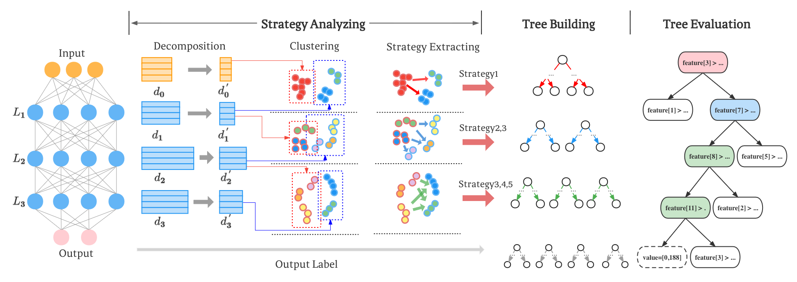
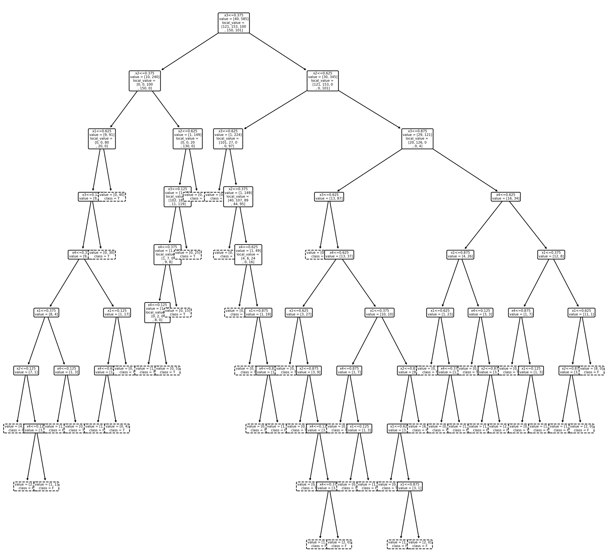
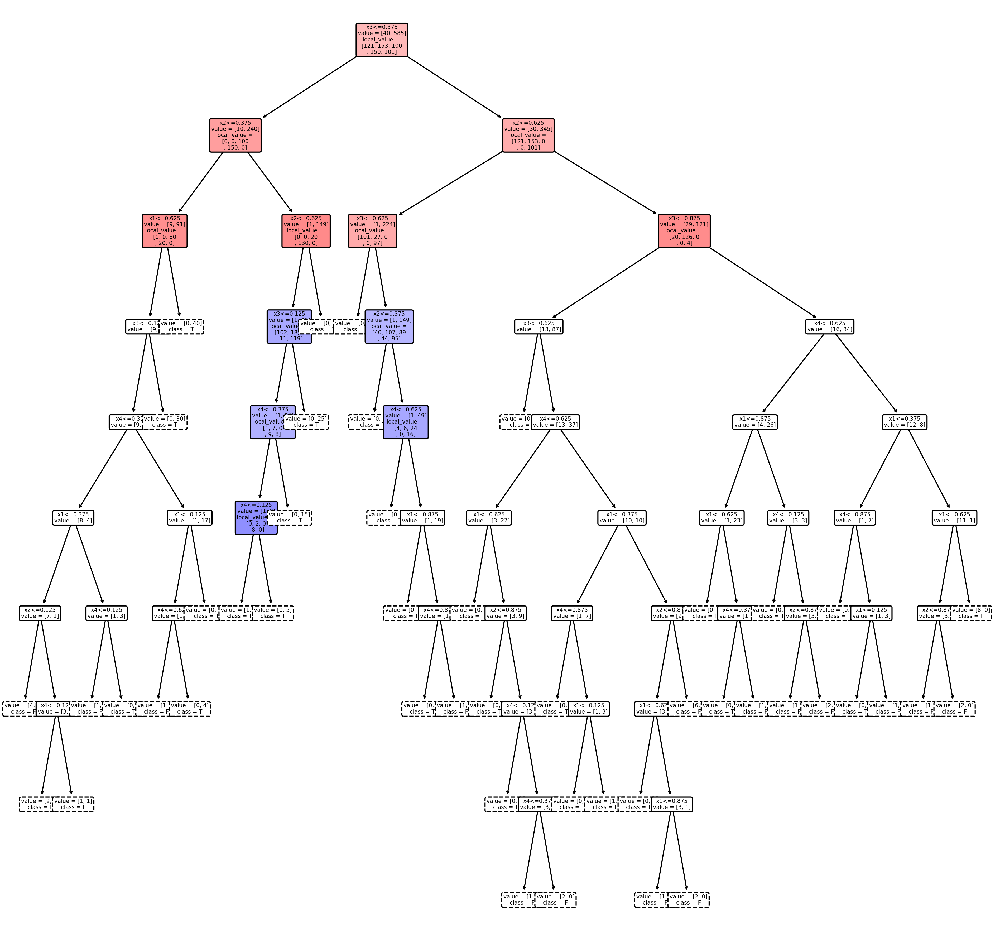

# Rashomon Tree (RTree)
A novel surrogate model called Rashomon Tree (Rtree) to inhibit the Rashomon effect of MLP. Our paper is currently under review by [AAAI2023](https://aaai.org/Conferences/AAAI-23/aaai23call/).

## What is the RTree?
Surrogate models are commonly adopted in explainable artificial intelligence (XAI). By Learning the relationships between the inputs and outputs of the black-box model, surrogate models such as decision trees can be used to inspect the intrinsic decision-making of the host model. However, different surrogate models or random initilization states may result in different explanations, which is call Rashomon effect. For this problem, we propose a novel surrogate model called Rashomon Tree (RTree) to inhibit this effect of the deep learning models.  

## Better Explanation
As Rtree is built in a strategy-level order manner which synchronized with the hidden-layers, users can better understand the decision-making of the deep-learning model through visualization.

    

decision tree (left) vs Rtree (right)

## Usage
Please refer to the Find01_example.ipynb for details.